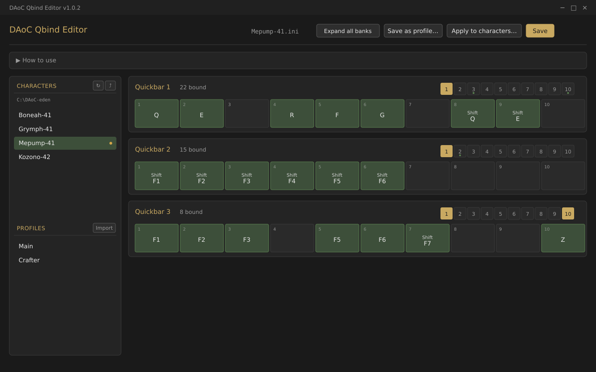
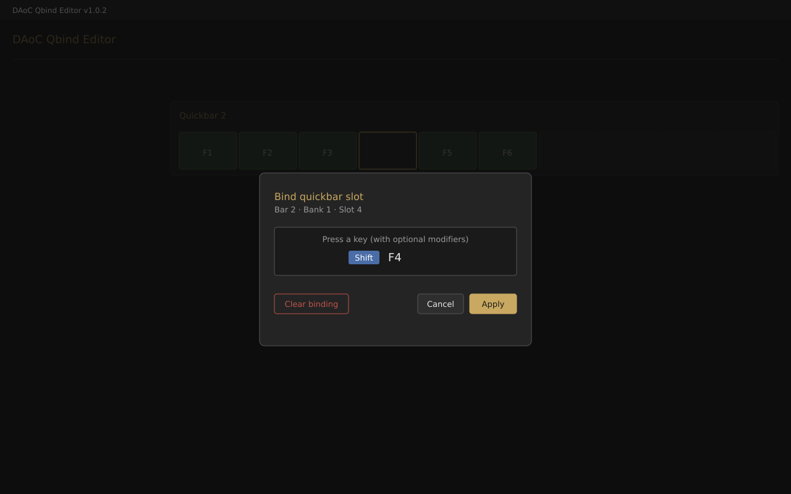
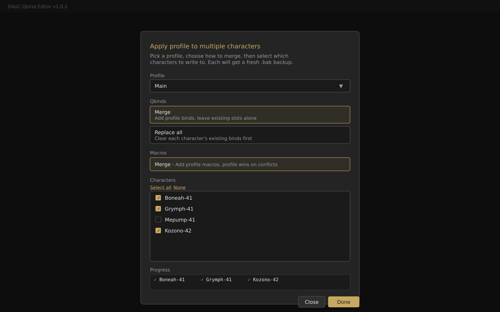

# DAoC Qbind Editor

A desktop application for managing **Dark Age of Camelot** quickbar key bindings (`/qbind`). Edit your binds visually instead of typing slash commands one at a time, save full setups as named profiles, and apply a profile to many characters at once.

Built specifically for the **Eden** freeshard but works with any DAoC client that uses the standard `Quickbar`/`QuickBinds` INI format.



## Features

- Visual editor showing all 3 quickbars × 10 banks × 10 slots, matching the in-game layout
- Press a key combo to bind it — no manual typing of `/qbind 1 2 1` commands
- Auto-detects your eden folder on first launch
- Sidebar lists all your characters, click to switch
- **Profile system**: save your full qbinds + macros setup as a named profile (e.g. "Main", "Crafter"), apply to any character with one click
- **Multi-character apply**: push a profile to multiple characters in one operation
- **Auto-backup**: creates `.bak` files before any write, so you can always roll back
- **DAoC-running detection**: warns you if the game is open, since the client overwrites the INI on logout
- Full Windows desktop app — no browser, no permissions hassles, no folder pickers for routine use

## Install

### Option 1: Download a release

Grab the latest `.exe` from the [Releases](../../releases) page. Two builds are produced:

- **`DAoC-Qbind-Editor-Setup-X.Y.Z.exe`** — Windows installer (creates Start Menu shortcut, can be uninstalled normally)
- **`DAoC-Qbind-Editor-X.Y.Z-portable.exe`** — single .exe, no install, run from anywhere

### Option 2: Build it yourself

Requires [Node.js 18+](https://nodejs.org/) (LTS recommended).

```bash
git clone https://github.com/achaitman/daocqbind.git
cd daocqbind
npm install
npm run build
```

Output goes into `dist/`. Use `npm start` to run in dev mode without building.

## Usage

1. **Launch the app.** It will auto-detect your eden folder (`%AppData%\Electronic Arts\Dark Age of Camelot\eden`). If your install is non-standard, use **File → Change eden folder…** to point it manually.
2. **Pick a character** from the sidebar.
3. **Click any slot** to bind it. Press the key combo you want (with `Shift`, `Ctrl`, or `Alt` if desired) and click Apply.

   

4. **Right-click any bound slot** to clear it instantly.
5. **Click Save** to write changes to disk. A `.bak` is created automatically the first time you save each character per session.

> ⚠️ **Always close DAoC before saving.** The game writes its own copy of the INI when you log out, which will overwrite your changes. The app shows a yellow banner if it detects DAoC running.

### Profiles

- **Save as profile…** — name and store your current qbinds + macros as a JSON file in the eden folder.
- **Click any profile in the sidebar** — opens a dialog to apply it to the current character. Choose **Merge** (add to existing) or **Replace all** (clean slate) for both qbinds and macros separately.
- **Apply to characters…** — pick a profile, check off the characters to update, click Apply. Each character gets a fresh `.bak`.

  

- **Import / Export** — profiles are plain JSON files. Share them with guildmates or back them up to cloud storage.

### Bar layout

Each bar shows one bank (10 slots) at a time, matching the in-game row. Click the numbered chips above the row to switch banks. Banks with bindings show a small green dot under the number. Click **Expand all banks** for a full 10×10 grid view of every bar.

## Format reference

The app reads and writes the standard DAoC INI format. Specifically:

- **`[QuickBinds]`** section, with lines like `Qbind109=16,4`
  - Address encoding: `(bar-1)*100 + bank*10 + (slot-1)`, where bar is 1–3, bank 1–10, slot 1–10
  - Key code: DirectInput scan code (e.g., 16 = Q, 44 = Z, 59 = F1)
  - Modifier: bitfield where Shift=1, Alt=2, Ctrl=4 (combinations sum)
- **`[Macros]`** section, with lines like `Macro_3=name,/command`
- All other sections are preserved byte-for-byte. The editor only modifies the sections it owns.

## Profile JSON format

```json
{
  "formatVersion": 1,
  "name": "PvE Reaver",
  "savedAt": "2026-05-01T12:00:00.000Z",
  "sourceCharacter": "Mepump-41",
  "binds": {
    "100": { "scan": 30, "mod": 4 },
    "109": { "scan": 16, "mod": 4 }
  },
  "macros": {
    "0": { "name": "MA", "command": "/assist Kozono" }
  }
}
```

## License

MIT. See [LICENSE](LICENSE).

## Contributing

This started as a personal tool. Pull requests welcome for bug fixes, additional scan code mappings, or new features. Major changes — please open an issue first to discuss.
